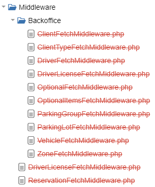

@title[Splash]
# Playmoove 

#### Shared mobility within everyone's reach
##### (developers included)
www.playmoove.com

---
@title[Who and What]
### about the project
<p class="text-left text-05">Build a framework for sharing mobility businesses that can allow any sharing strategy of any (connected) vehicle without imposing business decisions.</p>
<p class="text-left text-05">Current solutions are very bulky, with complex api, not white-label and with limited functionality.</p>
 
### about me
```php
$speaker = new Nerd();
$speaker->fullName = 'Riccardo Scasseddu';
$speaker->twitterHandle = '@ennetech';
$speaker->occupation = 'Technical lead @ designbrothers';
$speaker->education = 'Writing thesis entitled `hacking ca(n|r)s`';
$speaker->roles = ['Full Stack Developer', 'DevOps'];
$speaker->wannaBe = 'System architect';
$speaker->talkSpeed = 1.2;
$speaker->start();
```
+++
# why laravel
<p class="fragment text-left text-07">PHP</p>
<p class="fragment text-left text-07">Vibrant community</p>
<p class="fragment text-left text-07">Wonderfull  documentation</p>
<p class="fragment text-left text-07">Great foundation for building REST api</p>

---
@title[Before we start]
### Software in 2017
<p class="fragment text-left text-07">Built software with colleagues, not against them</p>
<p class="fragment text-left text-07">Balance technical debt and rapid development</p>
<p class="fragment text-left text-07">Do not overthink, use prototypes to explore</p>
<p class="fragment text-left text-07">Automate all the things</p>
<p class="fragment text-left text-07">Document REST api with proper tools (Word is not a proper tool)</p>
<p class="fragment text-left text-07">Use base classes</p>

<span style="font-size:0.6em; color:gray">SIMPLE</span> |
<span style="font-size:0.6em; color:gray">EXTENSIBLE</span> |
<span style="font-size:0.6em; color:gray">REVISABLE</span>

Note:
doing is the best way of thinking
---
@title[Better controllers]

# Write better controllers


+++

##### Rules of thumb for better controllers
<p class="fragment text-left text-07">No exception throwing inside</p>
<p class="fragment text-left text-07">No validation logic</p>
<p class="fragment text-left text-07">No formatting logic</p>
<p class="fragment text-left text-07">No model fetching if directly deducible from the request</p>
+++

@title[Eloquent model binding]
### Routing: Eloquent model binding
#### Encapsulate path parameter fetch
```php
Route::get('api/users/{user}', function (App\Models\User $user) {
    // Do something with the user
});
```
+++
@title[Form request]
### Validation: Form requests
#### Encapsulate validation and authorization logic
```php
class BaseRequest extends FormRequest
{
    public function authorize()
    {
        return logicThatDecideIfTheRequestIsAuthorized();
    }

    public function rules()
    {
        return [
           'id' => 'required|numeric',
           ...
        ];
    }
}
```
+++
@title[Eloquent resources]
### Eloquent: API Resources
#### Encapsulate formatting logic
```php
class User extends Resource
{
    public function toArray($request)
    {
        return [
            'id' => $this->id,
            'name' => $this->name,
            ...
        ];
    }
}
```
+++
### Example
```php
Route::get('api/users/{user}', function (UserRequest $request, App\Models\User $user) {
    $request->convenienceMethod()
    return new UserResource($user);
});
```
+++

## Resources
https://laravel.com/docs/5.5/routing#route-model-binding
https://laravel.com/docs/5.5/eloquent-resources
https://laravel.com/docs/5.5/validation#creating-form-requests
---
@title[Response time]
# Enhance response time


+++

##### Rules of thumb for better response time
<p class="fragment text-left text-07">Load the full dataset as needed</p>
<p class="fragment text-left text-07">Demand heavy and asyncronous task to workers</p>

+++
@title[Queues]
### Queues

```php
namespace App\Jobs;

use Illuminate\Bus\Queueable;
use Illuminate\Queue\SerializesModels;
use Illuminate\Queue\InteractsWithQueue;
use Illuminate\Contracts\Queue\ShouldQueue;
use Illuminate\Foundation\Bus\Dispatchable;

class MyJob implements ShouldQueue
{
    use Dispatchable, InteractsWithQueue, Queueable, SerializesModels;

    protected $payload;

    public function __construct($payload)
    {
        $this->payload = $payload;
    }

    public function handle($processor)
    {
        sleep(1000)
    }
}

dispatch(new MyJob);
```
+++

@title[Eloquent eager loading]
### Eloquent eager loading

N+1 => 2

```php
$books = App\Book::with('author')->get();
```
+++
## Resources
https://laravel.com/docs/5.5/queues
https://laravel.com/docs/5.5/eloquent-relationships#eager-loading
https://blog.frankdejonge.nl/parallelise-synchronous-business-processes/
---
@title[Write better code]
# Starve for better code


+++

##### Rules of thumb for better code quality and developing experience
<p class="fragment text-left text-07">Every function encapsulate a SPECIFIC part of the logic</p>
<p class="fragment text-left text-07">Hides implementation details</p>
<p class="fragment text-left text-07">Respect the standards</p>
<p class="fragment text-left text-07">When something goes wrong you can know why and what quickly</p>

+++
@title[morph paradigm]
## morph paradigm
#### Morphable model (Actual 'base' implementation)
```php
class Log extends Model
{
    public function loggable()
    {
        return $this->morphTo();
    }

    public function user()
    {
        return $this->morphTo();
    }
}
```
+++
@title[morph paradigm]
## morph paradigm
#### Trait (Apply to model)
```php
trait Loggable
{
    public function log($action, $payload = null)
    {
        $log = new Log();
        $log->action = $action;
        $log->payload = $payload;
        $log->snapshot = $this->toArray();
        $log->ip_address = request()->ip();
        $log->loggable()->associate($this);
        $user = \Auth::user();
        if ($user) {
            $log->user()->associate($user);
        }
        $log->saveOrFail();
    }
}
```
+++

## Isolate request specific code with middlewares
```php
class LangMiddleware
{
    public function handle($request, Closure $next, $guard = null)
    {
        if ($request->header("lang")) {
            $requestedLang = $request->header("lang");
            if (in_array($requestedLang, config('app.locales'))) {
                \App::setLocale($requestedLang);
            } else {
                throw new LocaleNotFoundException();
            }
        }
        return $next($request);
    }
}
```
+++
@title[Log exceptions]
## Log exceptions
```php
    public function report(Exception $exception)
    {
        $exception = [];
        $request = [];

        // Add relevant data to the arrays

        try {
            $system_exception = new SystemException();
            $system_exception->exception = $exception;
            $system_exception->request = $request;
            $system_exception->save();
        } catch (Exception $new) {
            // Empty catch, needed to avoid exception loop
        }

        parent::report($exception);
    }
```
+++
## Give user coherent messages
```php
    public function render($request, Exception $exception)
    {
        if ($request->wantsJson()) {
            $parsedException = // Format the response as you wish
            return $parsedException;
        }
        return parent::render($request, $exception);
    }
``` 
+++
@title[Exception rendering]
## Exception rendering

```
/*
 * @see 403 AuthorizationException (Forbidden)
 *     The request was valid, but the server is refusing action.
 *     The user might not have the necessary permissions for a resource.
 * @see 404 NotFoundException (Not Found)
 *     The requested resource could not be found but may be available in the future.
 *     Subsequent requests by the client are permissible
 * @see 409 RequirementException (Conflict)
 *     Indicates that the request could not be processed because of conflict in the request,
 *     such as an edit conflict between multiple simultaneous updates.
 * @see 422 UnprocessableException (Unprocessable Entity)
 *     The request was well-formed but was unable to be followed due to semantic errors.
 */
 ```

+++
@title[One problem = One exception]
## One problem = One exception
### Bad
```php
throw new ErrorException();
```
### Good
```php
throw new PaymentFailedException($reason);
```
+++
## Resources
https://laravel.com/docs/5.5/errors#report-method
https://laravel.com/docs/5.5/errors#render-method
https://laravel.com/docs/5.5/errors#renderable-exceptions
https://github.com/lucid-architecture/laravel
http://laravel-italia.it/articoli/principi-solid-in-php/introduzione
https://medium.com/@enne/exception-handling-for-json-endpoints-in-a-laravel-5-application-95971c548f15
---
@title[Questions]
## Developers are humans
+++
```php
$now = time();
if (date('U', strtotime($this->start)) > $now || date('U', strtotime($this->end)) < $now || $parameters["end"] < $now) {
    return false;
}
```
+++
```php
try {
    // Dangerous action
} catch (ValidationException $e) {
    \DB::rollBack();
    return JsonResponseAdapter::generateResponse(trans('request.validation-failed'), 400, $e->validator->getMessageBag()->all());
} catch (ModelNotFoundException $e) {
    \DB::rollBack();
    return JsonResponseAdapter::generateResponse(trans('request.invalid-type'), 400, []);
} catch (\Exception $e) {
    \DB::rollBack();
    return JsonResponseAdapter::generateResponse(trans('request.failed'), 400, [$e->getMessage()]);
}
```
+++

+++
```php
if ($reservation->buildCurrentBooking()) {
    if ($reservation->change()) {
        \DB::commit();
        return $this->sendReservation($reservation);
        } else {
            \DB::rollBack();
            return false;
            throw new ReservationException("change failed");
        }
    } else {
        \DB::rollBack();
        return false;
        throw new ReservationException("buildCurrentBooking failed");
    }
}    
```
---
@title[Questions]
# Questions?
